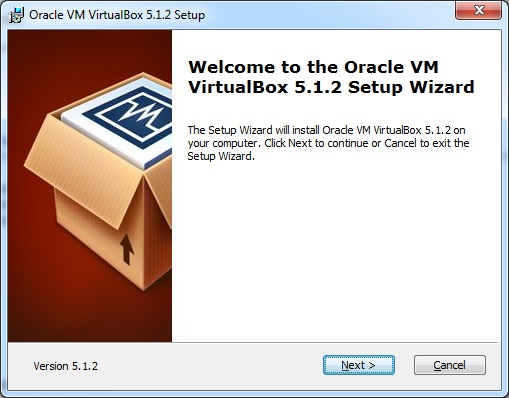
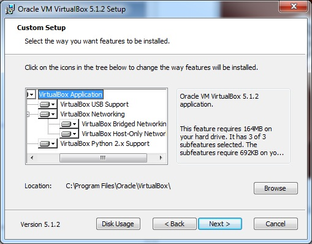
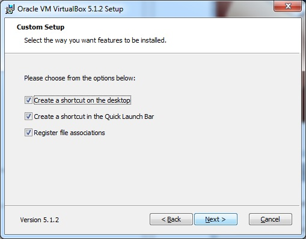
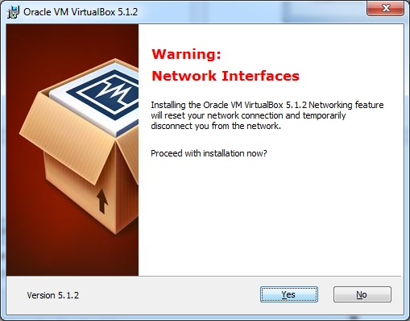
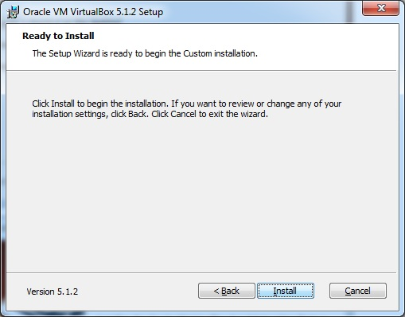
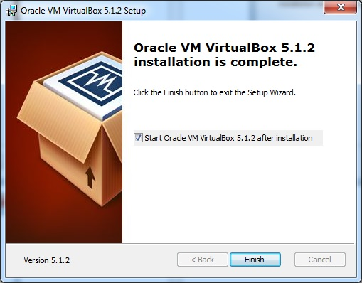
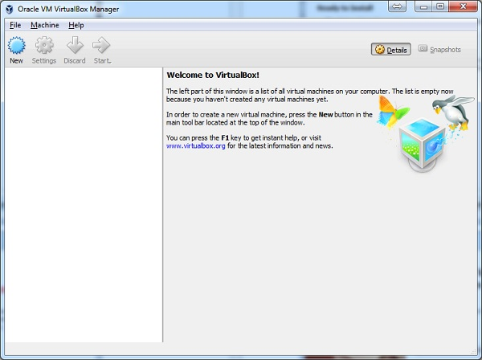

 <h1>Download and Install the Virtual Box</h1>

A Virtual Box is particularly useful when you want to test something on Kali Linux that you are unsure of. Running Kali Linux on a Virtual Box is safe when you want to experiment with unknown packages or when you want to test a code.

With the help of a Virtual Box, you can install Kali Linux on your system (not directly in your hard disk) alongside your primary OS which can MAC or Windows or another flavor of Linux.

Lets understand how you can download and install the Virtual Box on your system.

Step 1 − To download, go to https://www.virtualbox.org/wiki/Downloads. Depending on your operating system, select the right package. In this case, it will be the first one for Windows as shown in the following screenshot.
  
 
Step 2 - Click Next

Step 3 - The next page will give you options to choose the location where you want to install the application. In this case, let us leave it as default and click Next.

Step 4 - Click Next and the following Custom Setup screenshot pops up. Select the features you want to be installed and click Next.

Step 5 - Click Yes to proceed with the installation.

Step 6 - The Ready to Install screen pops up. Click Install.

Step 7 - Click the Finish button.

The Virtual Box application will now open as shown in the following screenshot. Now we are ready to install the rest of the hosts for this manual and this is also recommended for professional usage.

