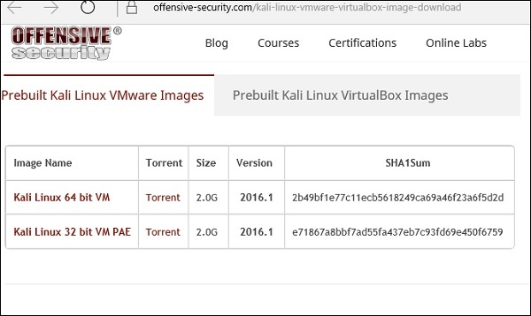
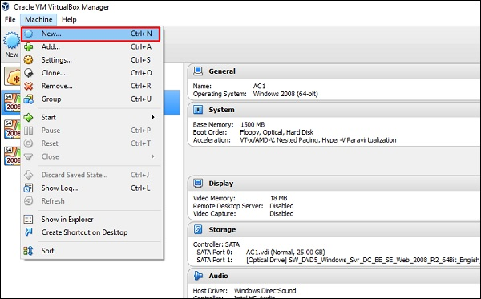
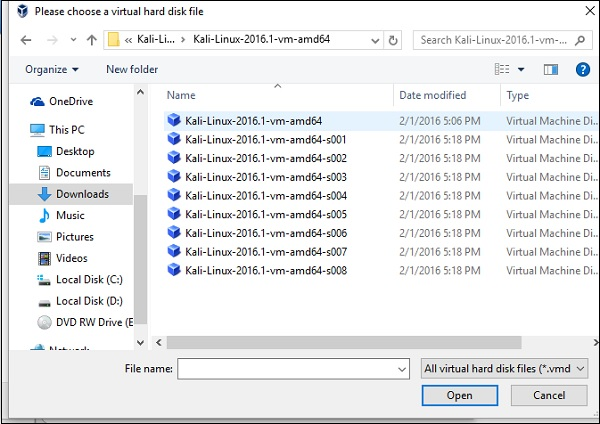
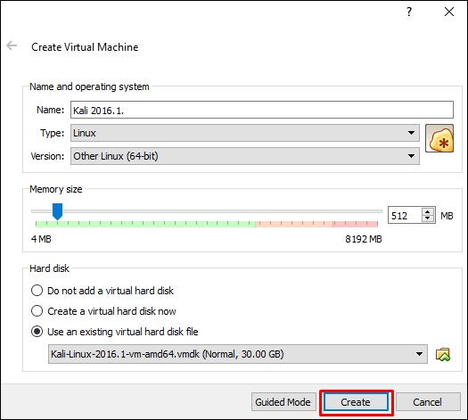
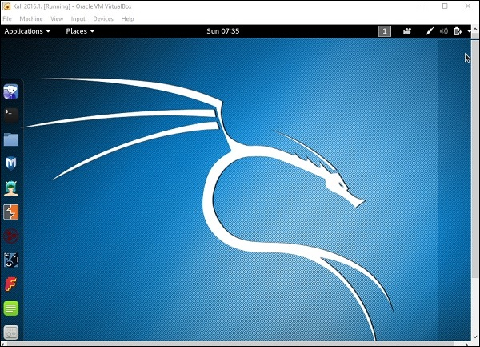

<h1>Install Kali Linux</h1>

## Now that we have successfully installed the Virtual Box, lets move on to the next step and install Kali Linux.
Step 1 − Download the Kali Linux package from its official website: https://www.kali.org/downloads/

 

 Step 2 − Click VirtualBox → New as shown in the following screenshot.

  

 Step 3 − Choose the right virtual hard disk file and click Open.

   

  Step 4 − The following screenshot pops up. Click the Create button.

   

   Step 5 − Start Kali OS. The default username is root and the password is toor.

   
