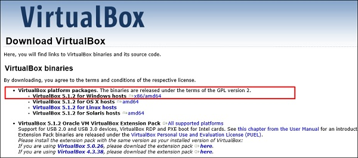

  
 
<h1>Download and Install the Virtual Box</h1>

A Virtual Box is particularly useful when you want to test something on Kali Linux that you are unsure of. Running Kali Linux on a Virtual Box is safe when you want to experiment with unknown packages or when you want to test a code.

With the help of a Virtual Box, you can install Kali Linux on your system (not directly in your hard disk) alongside your primary OS which can MAC or Windows or another flavor of Linux.

Lets understand how you can download and install the Virtual Box on your system.

Step 1 − To download, go to https://www.virtualbox.org/wiki/Downloads. Depending on your operating system, select the right package. In this case, it will be the first one for Windows as shown in the following screenshot.
